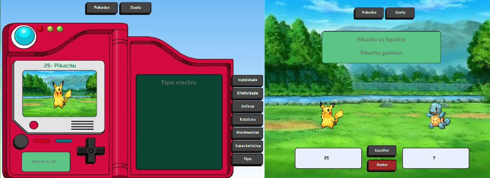
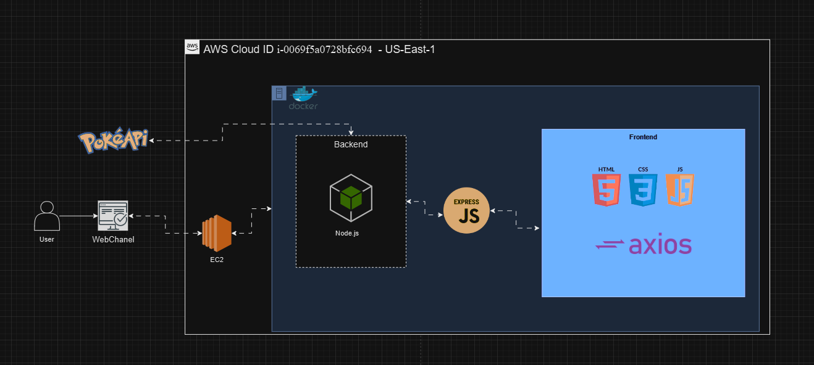

<h1 align="center"> INTERFACE PARA CONSULTA DA API PÚBLICA POKÉAPI</h1>


<h2 align="center"> <i>Saiba mais sobre os Pokemóns utilizando esta interface</i></h2>





## Introdução

<p align="justify">

Este projeto é uma aplicação web interativa que oferece uma interface para consulta da API pública POKÉAPI. O sistema possui dois modos principais: **Pokedex** e **Duelo**. No modo Pokedex, o usuário pode visualizar informações detalhadas sobre o Pokémon. No modo Duelo, o usuário pode selecionar dois Pokémons para batalharem entre si. O sistema é containerizado com Docker e hospedado na AWS.
</p>

## Entendimento dos Requisitos

### Funcionais
<p align="justify">
- O sistema deve oferecer uma interface para consulta à API pública POKÉAPI.
</p>
<p align="justify">
- Deve possuir dois modos: Pokedex e Duelo.
</p>
<p align="justify">
- Modo Pokedex: O usuário pode visualizar informações sobre o Pokémon.
</p>
<p align="justify">
- Modo Duelo: O usuário pode selecionar dois Pokémons para duelarem entre si.
</p>
<p align="justify">
- O sistema deve estar containerizado com Docker e hospedado na AWS
</p>

### Não funcionais
<p align="justify">
- Performance: O sistema deve responder às consultas de forma eficiente.
</p>


## Arquitetura do Projeto:


<p align="center">
  
</p>


**Frontend**
<p align="justify">

- Uma única página HTML que alterna entre os modos Pokedex e Duelo.
- CSS para estilização.
- JavaScript para lógica e manipulação do DOM.
</p>

**Backend**
<p align="justify">

- Node.js server que serve a página HTML e interage com a POKÉAPI.
</p>

**Infraestrutura**
<p align="justify">

- Container Docker que contém o servidor Node.js.
- Implementação na AWS utilizando EC2 para hospedar o container Docker.
</p>


## Estrutura de pastas

 ```sh
root/
│
├── docs/
│   ├── README.md
│   └── Pokedex.png
│
├── src/
│   ├── css/
│   │   └── styles.css
│   ├── js/
│   │   └── scripts.js
│   ├── public/
│   │   └── index.html
│   ├── server/
│   │   └── server.js
│   ├── Dockerfile
│   ├── package-lock.json
│   ├── package.json
│   └── .gitignore
│
└── node_modules/ 
```


## Como executar o projeto
<p align="justify">


### Pré-requisitos
- Docker instalado
- Node.js instalado


### Passos
1) Clone o repositório:
    ```sh
    git clone https://github.com/PamelaPavan/pokeapi.git
    ```
2) Instale as dependências:
    ```sh
    npm install express axios helmet node-cache
    ```
    
3) Rode a aplicação:
    ```sh
    npm start
    ```
4) Para rodar com Docker:


    <i>Construa a imagem Docker:</i>
    ```sh
    docker build -t sprints-2-3-pb-aws-abril .
    ```
    <i>Rode o contêiner:</i>
    ```sh
    docker run -p 3000:3000 sprints-2-3-pb-aws-abril
    ```
5) Acesse no navegador:
    [http://localhost:3000](http://localhost:3000)
</p>


## Como Utilizar
<p align="justify">


### Para a utilização do modo Pokedex


1) Clique no botão "Pokedex";
2) Clique no campo de busca no canto inferior esquerdo da pokedex;
3) Insira o nome ou o id de um pokemón;
4) Selecione o tipo de informação que deseja saber sobre o pokemón escolhido ('Habilidade', 'Efetividade', 'Defesa', 'Estatura', 'Movimentos', 'Característica' ou 'Tipo').


### Para a utilização do modo Duelo


1) Clique no botão "Duelo";
2) Clique no campo de busca do jogador 1, localizado no canto inferior esquerdo;
3) Insira o nome ou id do Pokemón para ser o jogador 1;
4) Clique no campo de busca do jogador 2, localizado no canto inferior direito;
5) Insira o nome ou id do Pokemón para ser o jogador 2;
6) Clique em inserir;
7) Clique no botão "Duelar";
8) O resultado do duelo aparecerá no campo de informações na tela.
</p>


## Detalhes do Desenvolvimento
<p align="justify">


### Passos


1) Escolher uma API pública;


2) Consumir esta API utilizando NodeJS;


3) Subir esta API utilizando Docker;


4) Criar uma página html para fazer consultas à API construída em NodeJS;


5) Subir o projeto NodeJS em Docker na cloud AWS.
</p>


## Licença


<p align="justify">
    Este projeto é distribuído sem uma licença explícita e é destinado ao uso educacional e de entretenimento.
</p>


## Autor

**Pâmela Aliny Cleto Pavan**
- Linkedin: www.linkedin.com/in/pâmela-pavan-607693190
- GitHub: https://github.com/PamelaPavan
- Email : pamelaaliny@gmail.com
